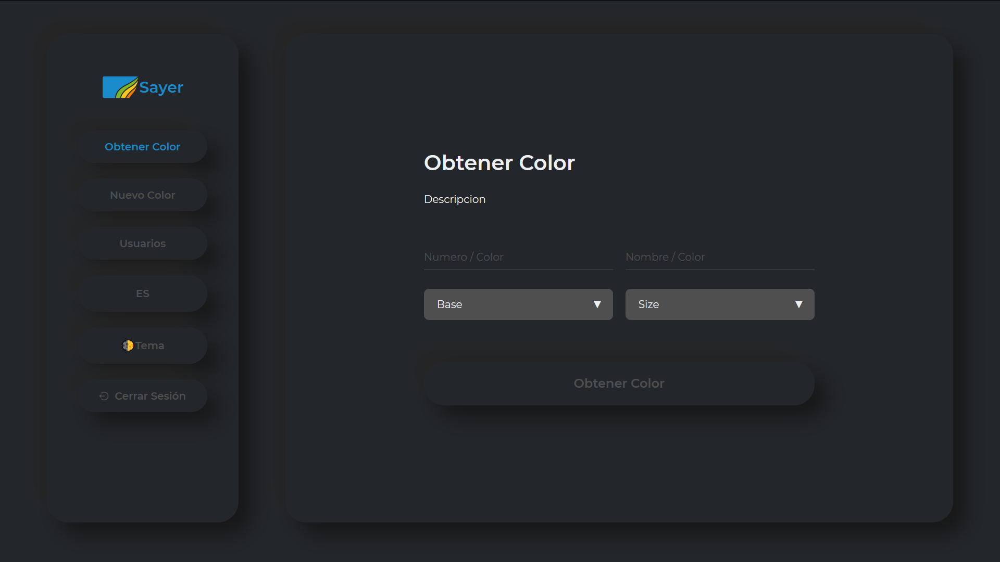

# Sayer Palette

Application buit with MERN stack, you can get the quantities of the inks depending on the color saved in a database.

**Live Preview:** [Sayer Palette](https://wildfire-tracker-six.vercel.app/ 'Wildfire Tracker React App')

### Tech/framework used

**Built with**

-   [Mongo DB](https://reactjs.org/)
-   [Express](https://api.nasa.gov/)
-   [React](https://reactjs.org/)
-   [Node js](https://api.nasa.gov/)

**For more info go to the [Wiki](https://github.com/a12989x/sayer-palette/wiki 'Wiki sayer palette')**

#### By **[a12989x](https://github.com/a12989x, 'Alexis Guzman')**
